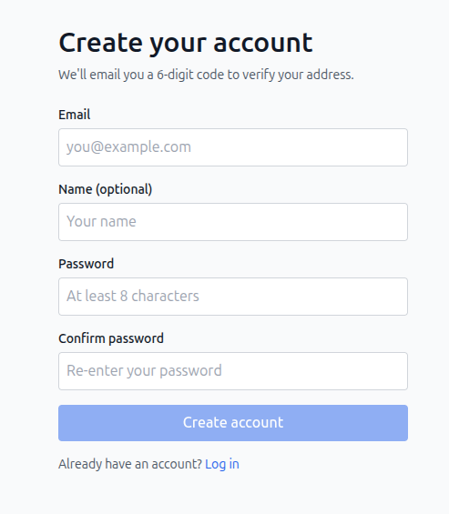
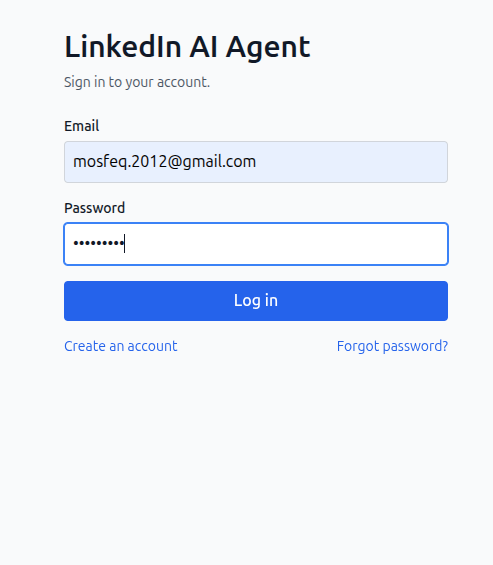
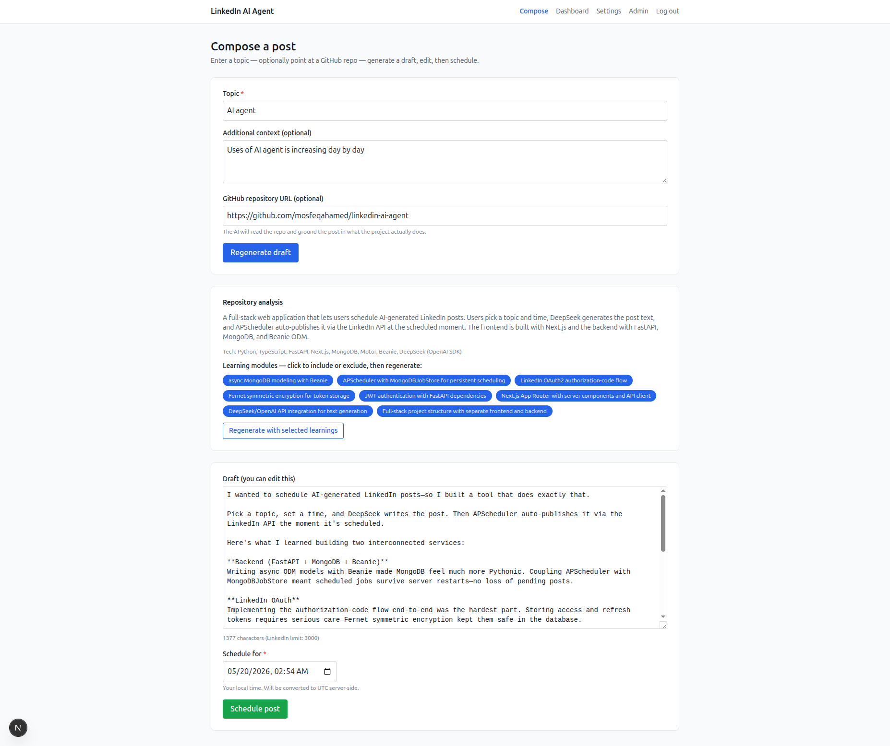
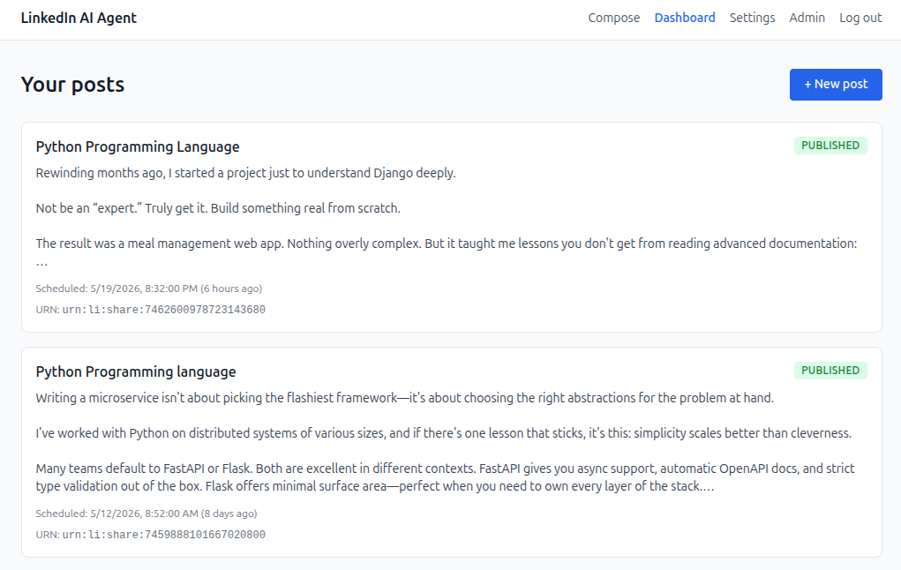
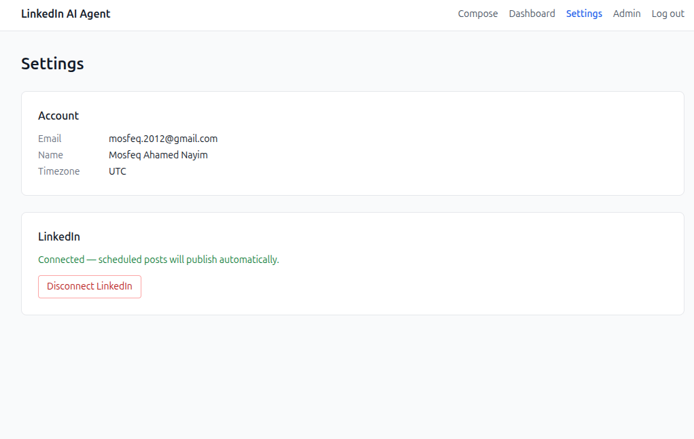
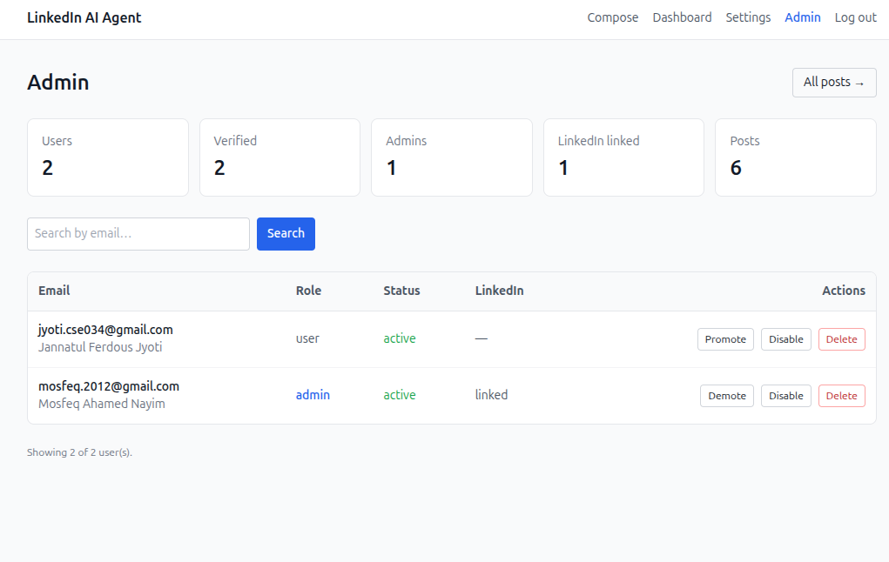

# LinkedIn AI Agent

A multi-user web platform for **AI-generated, auto-scheduled LinkedIn posts**.

Users register with email + password (verified by a one-time code), describe a
topic — optionally pointing at a **GitHub repository** — and DeepSeek writes a
LinkedIn post grounded in the project. The post is scheduled, and APScheduler
publishes it through the LinkedIn API at the chosen time. Admins manage users
and posts from a dedicated dashboard.

---

## Table of contents

- [Features](#features)
- [Screenshots](#screenshots)
- [Tech stack](#tech-stack)
- [Architecture](#architecture)
- [Project layout](#project-layout)
- [Getting started](#getting-started)
- [Environment variables](#environment-variables)
- [How it works](#how-it-works)
- [API reference](#api-reference)
- [LinkedIn setup](#linkedin-setup-for-auto-posting)
- [Roadmap](#roadmap)

---

## Features

### Authentication & accounts
- **Email + password registration** with bcrypt-hashed passwords.
- **Email verification by OTP** — a 6-digit code is emailed on sign-up; the
  account is unusable until verified.
- **Forgot / reset password** — same OTP mechanism, with no account enumeration
  (identical response whether or not the email exists).
- **Resend code** with a per-email cooldown; OTPs expire after 10 minutes and
  lock after 5 wrong attempts.
- Unverified accounts are **auto-deleted after 24 hours** by a background job.
- Email delivery has two modes — `console` (prints the code to the server log,
  for local testing) and `smtp` (real email, e.g. Gmail).

### Admin
- Role-based access (`user` / `admin`); admins are bootstrapped via the
  `ADMIN_EMAILS` setting.
- Admin dashboard with **platform stats**, a **searchable user table**, and
  per-user actions: promote/demote, enable/disable, **hard-delete**.
- Global **all-posts** view across every user.
- Self-protection guard rails — an admin cannot demote, disable, or delete
  their own account.
- Disabling a user revokes their access immediately.

### AI post generation
- DeepSeek (`deepseek-chat`) writes LinkedIn-ready posts from a topic and
  optional context.
- **GitHub-aware generation** — paste a repo URL and a two-stage pipeline runs:
  1. **Analyzer** — reads the repo's README, metadata, languages and file tree,
     and returns a structured summary, tech stack, key features and
     **learning modules**.
  2. **Post writer** — generates a post grounded in that analysis.
- Learning modules are shown as **chips** you can toggle on/off, then regenerate
  to re-focus the post — without re-analyzing the repo (results are cached 24h).

### Scheduling & publishing
- Pick a date/time; APScheduler (with a MongoDB job store) auto-publishes via
  the LinkedIn UGC Posts API.
- Per-post status tracking: `draft`, `scheduled`, `publishing`, `published`,
  `failed`, `cancelled`.
- Daily cron refreshes LinkedIn access tokens before they expire.

### Security
- Session JWTs; LinkedIn OAuth tokens encrypted at rest with Fernet.
- LinkedIn OAuth `state` stored in MongoDB with a TTL index — safe across
  multiple workers and restarts.
- OTPs are hashed before storage.

---

## Screenshots

### Register

Create an account with email, name and password. A 6-digit verification code is
emailed before the account is activated.



### Log in

Returning users sign in with email and password, with links to register or
reset a forgotten password.



### Compose — with GitHub repository analysis

Enter a topic, optionally paste a GitHub repo URL. The AI analyzes the
repository and surfaces **learning modules** as toggleable chips; regenerate to
re-focus the draft, then schedule.



### Dashboard

Every post with its live status — published, scheduled, failed or cancelled —
its scheduled time, and the LinkedIn share URN once live.



### Settings

Connect or disconnect a LinkedIn account. Once connected, scheduled posts
publish automatically.



### Admin dashboard

Platform stats plus a searchable user table — promote/demote, enable/disable or
delete users.



---

## Tech stack

| Layer | Technology |
|---|---|
| Backend | **FastAPI** + **Uvicorn** (async Python) |
| Database | **MongoDB** + **Beanie** ODM (on **Motor**/PyMongo async) |
| Text generation | **DeepSeek** `deepseek-chat` via the OpenAI SDK |
| Scheduling | **APScheduler** with `MongoDBJobStore` (survives restarts) |
| Publishing | **LinkedIn UGC Posts API** (`w_member_social`) |
| Auth | JWT sessions, **bcrypt** password hashing, OTP email verification |
| Encryption | **Fernet** — LinkedIn OAuth tokens encrypted at rest |
| Email | SMTP (e.g. Gmail) or console mode |
| Frontend | **Next.js 15** (App Router) + **React 19** + **TypeScript** |
| UI | **Tailwind CSS**, **TanStack Query** |

---

## Architecture

```
Browser (Next.js)
      │  JWT in Authorization header
      ▼
FastAPI ── routers ── auth · generate · posts · admin
      │
      ├── services ── deepseek (analyze + write)
      │               github   (repo fetch)
      │               otp / email (verification codes)
      │               linkedin (OAuth + publishing)
      │               scheduler (APScheduler jobs)
      │
      ▼
MongoDB ── users · scheduled_posts · email_verifications
           oauth_states · repo_cache · apscheduler_jobs
```

Background jobs:
- **publish** — one-shot job per scheduled post.
- **token refresh** — daily, refreshes LinkedIn tokens near expiry.
- **cleanup** — hourly, deletes unverified accounts older than 24h.

TTL indexes auto-expire OTPs, OAuth states and repo-analysis cache entries.

---

## Project layout

```
linkedin-ai-agent/
├── app/                              ← FastAPI backend
│   ├── main.py                       FastAPI entry + lifespan
│   ├── config.py                     Settings (env-driven)
│   ├── db.py                         Mongo client + Beanie init
│   ├── security.py                   Fernet, JWT, password/OTP hashing
│   ├── deps.py                       get_current_user, require_admin
│   ├── schemas.py                    Pydantic request/response models
│   ├── models/
│   │   ├── user.py                   User (role, verification, LinkedIn)
│   │   ├── post.py                   ScheduledPost (+ repo fields)
│   │   ├── email_verification.py     OTP records (TTL)
│   │   ├── oauth_state.py            LinkedIn OAuth state (TTL)
│   │   └── repo_cache.py             Cached repo analysis (TTL)
│   ├── routers/
│   │   ├── auth.py                   register, verify, login, reset, LinkedIn
│   │   ├── generate.py               POST /generate (GitHub pipeline)
│   │   ├── posts.py                  post CRUD + schedule + regenerate
│   │   └── admin.py                  user & post management
│   └── services/
│       ├── deepseek.py               analyze_repo + generate_post
│       ├── github.py                 repo fetching
│       ├── otp.py                    OTP issue/verify
│       ├── email.py                  SMTP / console email
│       ├── linkedin.py               OAuth + UGC Posts API
│       └── scheduler.py              APScheduler jobs
├── frontend/                         ← Next.js 15 frontend
│   └── src/
│       ├── app/                      login, register, verify-email,
│       │                             forgot/reset-password, compose,
│       │                             dashboard, settings, admin
│       ├── components/               Nav, Field, PostCard, StatusBadge
│       └── lib/                      API client, auth, types, hooks
├── image/                            README screenshots
├── docker-compose.yml                Local MongoDB
├── pyproject.toml
└── .env.example
```

---

## Getting started

### Prerequisites

- Python 3.11+ and [`uv`](https://docs.astral.sh/uv/)
- Node.js 18+ (with `npm` or `pnpm`)
- MongoDB — local (via Docker) or a MongoDB Atlas connection string

### 1. Configure the backend

```bash
cp .env.example .env
```

Fill in `.env` (see [Environment variables](#environment-variables)). At minimum:

```bash
# Generate a Fernet key:
python -c "from cryptography.fernet import Fernet; print(Fernet.generate_key().decode())"
```

Set `MONGODB_URI`, `DEEPSEEK_API_KEY`, `JWT_SECRET`, `FERNET_KEY`, and the email
settings.

### 2. Run the backend

```bash
uv sync
uv run uvicorn app.main:app --reload      # http://localhost:8000
```

Swagger UI: [http://localhost:8000/docs](http://localhost:8000/docs)

### 3. Run the frontend

```bash
cd frontend
cp .env.local.example .env.local          # sets NEXT_PUBLIC_API_URL
npm install
npm run dev                                # http://localhost:3000
```

### 4. Use it

Open [http://localhost:3000](http://localhost:3000) → **Create an account** →
enter the OTP from your email (or the server log in `console` mode) → compose a
post. Registering with an email listed in `ADMIN_EMAILS` makes that account an
admin.

---

## Environment variables

Backend (`.env`):

| Variable | Description |
|---|---|
| `ENVIRONMENT` | `development` or `production` |
| `MONGODB_URI` | MongoDB connection string |
| `MONGODB_DB_NAME` | Database name |
| `DEEPSEEK_API_KEY` | DeepSeek API key (required) |
| `DEEPSEEK_BASE_URL` / `DEEPSEEK_MODEL` | DeepSeek endpoint / model |
| `JWT_SECRET` | Secret for signing session JWTs |
| `FERNET_KEY` | Base64 Fernet key for encrypting LinkedIn tokens |
| `FRONTEND_ORIGIN` | Allowed CORS origin(s), comma-separated |
| `EMAIL_MODE` | `console` (log the OTP) or `smtp` (real email) |
| `SMTP_HOST` / `SMTP_PORT` / `SMTP_USER` / `SMTP_PASSWORD` | SMTP settings (Gmail needs an App Password) |
| `EMAIL_FROM` | "From" address for emails |
| `ADMIN_EMAILS` | Comma-separated emails that become admins on registration |
| `LINKEDIN_CLIENT_ID` / `LINKEDIN_CLIENT_SECRET` / `LINKEDIN_REDIRECT_URI` | LinkedIn OAuth app credentials |
| `GITHUB_TOKEN` | *Optional* — raises the GitHub API rate limit (60 → 5000/hr) |

Frontend (`frontend/.env.local`):

| Variable | Description |
|---|---|
| `NEXT_PUBLIC_API_URL` | Backend base URL (default `http://localhost:8000`) |

---

## How it works

### Authentication flow

```
Register ──▶ OTP emailed ──▶ Verify email ──▶ session JWT ──▶ app
Login ─────────────────────────────────────▶ session JWT ──▶ app
Forgot password ─▶ OTP emailed ─▶ Reset password ─▶ session JWT
```

- Passwords are bcrypt-hashed; OTPs are hashed before storage.
- An unverified account cannot log in; it is deleted after 24h if never verified.
- LinkedIn is **not** the login method — it is connected separately from
  **Settings** and is used only for publishing.

### GitHub-aware generation

```
GitHub URL ─▶ fetch repo (README, languages, files)
           ─▶ Stage 1: analyzer ─▶ {summary, tech_stack,
                                     key_features, learning_modules}
           ─▶ Stage 2: post writer (topic + analysis) ─▶ LinkedIn post
```

The analysis is cached in MongoDB for 24 hours (keyed by the repo's last push),
so toggling learning-module chips and regenerating does not re-hit the GitHub or
analyzer calls.

---

## API reference

All endpoints except auth require an `Authorization: Bearer <token>` header.

### Auth

| Method | Path | Description |
|---|---|---|
| `POST` | `/auth/register` | Create account, email an OTP |
| `POST` | `/auth/verify-email` | Verify OTP → session token |
| `POST` | `/auth/resend-otp` | Re-send the verification code |
| `POST` | `/auth/login` | Email + password → session token |
| `POST` | `/auth/forgot-password` | Email a reset code |
| `POST` | `/auth/reset-password` | Reset password via OTP → session token |
| `GET` | `/auth/me` | Current user |
| `GET` | `/auth/linkedin/authorize-url` | Start LinkedIn OAuth |
| `GET` | `/auth/linkedin/callback` | LinkedIn OAuth callback |
| `POST` | `/auth/linkedin/disconnect` | Remove LinkedIn connection |

### Generation & posts

| Method | Path | Description |
|---|---|---|
| `POST` | `/generate` | Generate a post (optionally from a GitHub repo) |
| `GET` | `/posts` | List the current user's posts |
| `POST` | `/posts` | Schedule a post |
| `PATCH` | `/posts/{id}` | Edit text / reschedule |
| `POST` | `/posts/{id}/regenerate` | Regenerate the draft |
| `DELETE` | `/posts/{id}` | Cancel a scheduled post |

### Admin (admin role required)

| Method | Path | Description |
|---|---|---|
| `GET` | `/admin/stats` | Platform statistics |
| `GET` | `/admin/users` | List/search users |
| `GET` | `/admin/users/{id}` | User detail |
| `PATCH` | `/admin/users/{id}` | Change role / enable-disable |
| `DELETE` | `/admin/users/{id}` | Hard-delete user and their posts |
| `GET` | `/admin/posts` | All posts across users |

---

## LinkedIn setup (for auto-posting)

1. Create an app at [developer.linkedin.com](https://developer.linkedin.com).
2. Add the **Sign In with LinkedIn using OpenID Connect** product.
3. Apply for the **Share on LinkedIn** product (grants `w_member_social`) —
   this requires LinkedIn review.
4. Register the redirect URL `http://localhost:8000/auth/linkedin/callback`
   (add your production URL later).
5. Copy the Client ID and Client Secret into `.env`.

Until those products are approved, only accounts listed as app developers can
connect LinkedIn.

---

## Roadmap

- Image generation for posts (Fal AI / FLUX integration).
- Automated tests (pytest backend, Playwright frontend).
- Production deployment configs (backend Dockerfile, Vercel for frontend).
- Move SMTP to a managed provider for production email deliverability.
